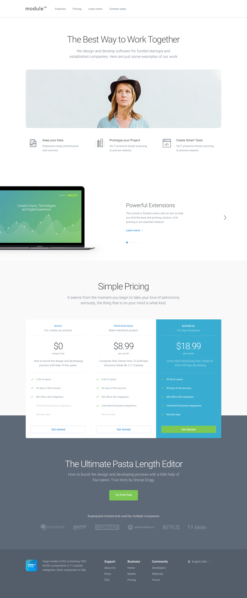

# Front-end Developer Test Project

## Project brief

Convert the following designs to a beautiful responsive website.  
The font used is for the whole site is
[Roboto](https://www.google.com/fonts#UsePlace:use/Collection:Roboto).

## Requirements

1. Make it responsive by your best judgement.
2. The site should be retina compatible.
3. Do not use any image, everything should be made using CSS3. The only images
allowed are logos or photos.
4. The header should be stick to the top of the viewport. 
 
We recommend you to use [Slick.js](http://kenwheeler.github.io/slick/) for any carousel on the page.
If you want to use another library because you think it's better feel free to do
it.

### Nice to have

At Pixel2HTML we love the [BEM methodology](https://en.bem.info/methodology/).
It helps to increase code reliability and reusable components. If you haven't
heard anything about BEM we strongly recommend you to dig more about it. This
test it's a great opportunity for giving it a try!

### Bonus tasks

1. Create project using [PX2HT Generator](https://github.com/Pixel2HTML/pixel2html-generator).
2. We'd like to see you using Stylus/SASS/LESS for the CSS, show us your magic :)
3. If you feel brave we encourage you to record yourself while coding the test 
page using http://livecoding.tv. Here is an example of what we would like to see: https://www.livecoding.tv/mike3run/videos/mBmrx-pixel2html-front-end-job-challenge-2

## Download PSD / Sketch

You can either clone this repository:

~~~
$ git clone http://code.pixel2html.com/recruiting/frontend-developer-test.git
~~~

Or download the design files directly from this links:

- Sketch file: [test.sketch](http://code.pixel2html.com/recruiting/frontend-developer-test/blob/master/assets/test.sketch)
- PSD file: [test.psd](http://code.pixel2html.com/recruiting/frontend-developer-test/blob/master/assets/test.psd)

## Supported browsers

Ensure that the elements work and display correctly in the following browsers
and OS devises:

#### Desktop

- Firefox       (latest version)
- Google Chrome (latest version)
- Safari        (latest version)
- Microsoft Edge
- Internet Explorer 11

#### Mobile

- Safari (iOS 9.0)
- Chrome (Android 5.0)

## Project delivery structure

Aside from whatever tool you use for coding this test the final deliverables
should have the following structure.

~~~
├── .
├── ..
├── dist
|   ├── images           # Images
|   ├── styles           # Global styles
|   |   └── main.css     # Main stylesheet (import everything to this file)
|   |   └── main.min.css # Minified version of the main stylesheet
|   ├── js               # Global scripts, base classes, etc
|   |   └── main.js      # Main javascript file
|   |   └── main.min.js  # Minified version of the main javascript file
|   ├── fonts            # Fonts
|   ├── index.html       # Screen template
├── ..
├── ..
├── ..
~~~

## Before you submit the test make sure your deliverables answers to this questions

1. Are all requirements met?
2. Do the page display and work correctly in all supported browsers?
3. Do the page display and work correctly in all supported OS devices?
4. Is reasonable pixel precision achieved?
5. Do the page work without JavaScript errors?

## Deliverables

- The files should be pushed to your Github account, if you don't have one you
can follow this link: https://github.com/join to get one, it's free!
- Cross-check all the details before pushing the final code for review.
- Track the time you spend, we recommend you [TOGGL](https://www.toggl.com/) for
this. Be honest :D

## Links

Here are some links that might be helpful:

- [Automating Tasks with GulpJS](https://scotch.io/tutorials/automate-your-tasks-easily-with-gulp-js)
- [CSSComb](https://github.com/csscomb/csscomb.js)
- [UnCSS](https://github.com/giakki/uncss)
- [How to use CSS Stats to check your code](http://webdesign.tutsplus.com/tutorials/understanding-css-stats-how-to-make-the-most-of-the-numbers--cms-22756)
- [BEM 101](https://css-tricks.com/bem-101/)

## Questions?

Fear not! You can send us an email to Diego [(diego@pixel2html.com)](mailto:diego@pixel2html.com)
or Juan Manuel [(jm@pixel2html.com)](mailto:jm@pixel2html.com) with the subject:
**'Front-end Test Project'**.

Happy Coding!

